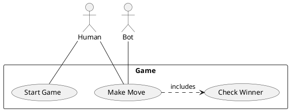
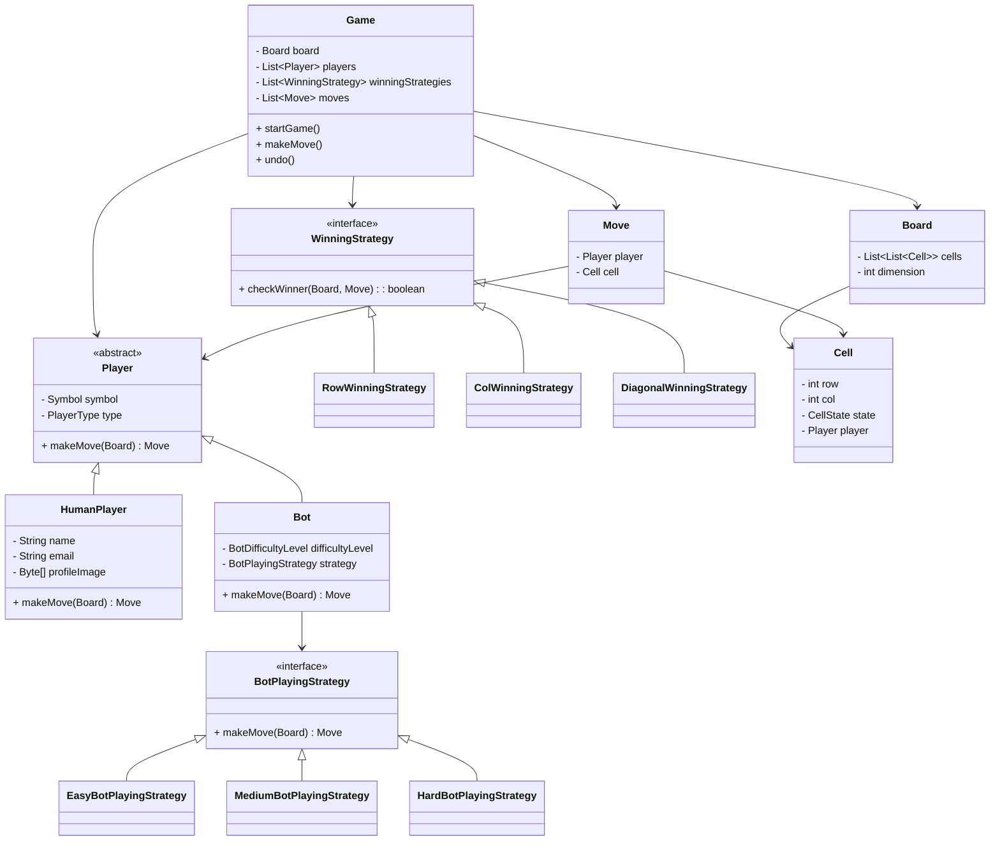

# 🎮 Design: Tic Tac Toe - Java OOP LLD

## 🧩 What is Tic-Tac-Toe?

Tic Tac Toe is a 2-player game played on a board of size NxN. Each player takes alternate turns and places their symbol (X or O) on the board. The player who places N of their symbols consecutively in a row, column, or diagonal wins. If all cells are filled and no one wins, it’s a draw.

You can even play this within Google by searching **“tic tac toe”**!


---

## ❓ Functional Questions Considered

- Is the board always 3x3? ❌ → It’s NxN.
- Are only 2 players allowed? ✅ for now (but extendable).
- Can one be a bot? ✅ Yes.
- Can we undo a move? ✅ Yes.
- Can we support winning in different ways? ✅ Yes.
- Is it extensible and testable? ✅ Definitely.

---

## ✅ Requirements

- Configurable board size (NxN)
- 2 Players (Human/Bot)
- Symbols: 'X' and 'O'
- Alternate moves
- Winning: full row/column/diagonal with same symbol
- Draw condition supported
- Bot with 3 difficulty levels
- Undo last move (for human)

---

## 🧱 Core Entities

| Entity         | Attributes                                      |
|----------------|--------------------------------------------------|
| Game           | Board, Players, Moves, GameState, Strategies     |
| Player         | Name, Symbol, PlayerType                         |
| Bot            | DifficultyLevel, Strategy                        |
| Human          | Name, Email, Image                               |
| Board          | Cells, Size                                      |
| Cell           | Row, Col, Player, State                          |
| Move           | Player, Cell                                     |
| Strategy       | Row/Col/Diagonal, Easy/Hard bot strategies       |

---

## 🧩 Design Diagrams

### ✅ Use Case Diagram



---

### ✅ Class Diagram (Cleaned LLD)



---

## 🚀 Features

- CLI-based game with undo support
- NxN board support
- Configurable winning strategies
- Bot difficulty control via Strategy pattern
- Proper abstraction via interfaces and factories

---

## 📁 Package Structure

```
src/
└── main/
    └── java/
        └── com/sarvesh/LLD3/TicTacToe/
            ├── controller/        # GameController
            ├── exception/         # InvalidMoveException
            ├── factory/           # Bot strategy factory
            ├── model/             # Game, Player, Board, Cell, Move
            ├── strategy/
            │   ├── botplayingstrategy/
            │   └── winningstrategy/
```

---

## 📌 Future Scope

- Convert CLI to REST API (Spring Boot)
- Add frontend for gameplay visualization
- Add game analytics and historical stats
- Tournament mode with multiple players

---

🧠 Designed using SOLID principles, Strategy pattern, and extensible game architecture.
